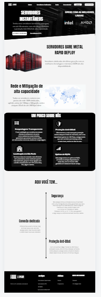

# Website da empresa LunarHosting

## Servidores Instantâneos

Este projeto é um site informativo para uma empresa que oferece servidores dedicados e VPS (Virtual Private Servers). O site apresenta informações sobre os serviços, benefícios e características dos servidores, além de permitir que os clientes acessem a área do cliente.

## Funcionalidades

- **Cabeçalho com Navegação:** Navegação fácil para acessar as diferentes seções do site.
- **Seção Principal:** Exibe o título e a descrição dos serviços oferecidos.
- **Seções de Serviços:** Informações detalhadas sobre servidores bare metal, rede e mitigação, e a história da empresa.
- **Cartões de Informações:** Apresenta informações relevantes sobre a empresa e seus serviços.
- **Responsividade:** O design é responsivo e se adapta a diferentes tamanhos de tela.

## Tecnologias Utilizadas

- **HTML:** Estrutura básica do site.
- **CSS:** Estilização e layout do site.
- **JavaScript (opcional):** Para futuras interações dinâmicas (não implementado neste projeto).

## Estrutura do Projeto feita pelo cliente no Canva:

  

